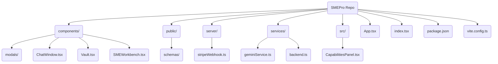

# 📘 SMEPro Frontend
A modern React + Vite single-page application (SPA) for SMEPro Intelligence AI, powered by the Google Gemini API. This frontend provides the Vault, Chat, Dashboard, and AI Safety interfaces for smepro.app, connecting to a backend deployed on Google Cloud Run.

## ✨ Features
- **SME ChatWindow**: Engage in contextual, collaborative SME sessions powered by Gemini. Add multiple experts to a single conversation.
- **SMEVault & Analyzer**: Save, search, and analyze curated knowledge items. Synthesize multiple items to generate new strategies and project briefs.
- **SMEBuilder & Toolchain**: Convert analysis into tangible assets like READMEs, technical docs, and social media posts using a contextual toolchain.
- **SMEWorkbench**: A powerful workspace with advanced AI tools for generating and editing text, images, and video from various inputs.
- **Workshop Mode**: A structured, collaborative environment where a team of AI experts can co-create and refine outputs based on a defined objective and agenda.
- **Interactive Action Mode**: Turns AI responses into interactive elements for deeper insights, step-by-step execution, and dynamic, context-aware tool suggestions.
- **SAFE AI**: An interactive page demonstrating SMEPro's commitment to safety and responsible AI.
- **SMEPro Review**: A competitive analysis tool to compare SMEPro against other top AI platforms.
- **Full-Featured UI**: Includes a dashboard, session history, profile management, and light/dark modes.

## 🚀 Tech Stack
- **React 18 + Vite 5**: For fast development and efficient build tooling.
- **TypeScript**: Ensures type safety and enhances code maintainability.
- **TailwindCSS**: A utility-first CSS framework for rapid UI development.
- **Google GenAI SDK (@google/genai)**: Powers all AI analysis, chat, and generation capabilities.
- **Stripe Elements (@stripe/react-stripe-js)**: For secure, embedded, production-ready payment processing.
- **Marked + Highlight.js**: Renders rich markdown content from AI responses.

## 📂 Project Structure
This diagram shows the high-level organization of the frontend application.



## 🔑 Key Architectural Protocols

### Backend-Driven Payment Flow
The application simulates a production-ready, secure payment flow. Instead of using client-side buy buttons, it follows these steps:
1.  The user provides their details in the `SignupModal`.
2.  The frontend calls the (mock) backend service `services/backend.ts` to create a `PaymentIntent`.
3.  The mock backend simulates creating a Stripe Customer, an Ephemeral Key, and a Payment Intent, returning a `clientSecret` to the frontend. This mirrors the logic of a real Node.js/Python backend.
4.  The frontend uses this `clientSecret` to securely render the Stripe `PaymentElement`, ensuring no sensitive payment operations occur on the client.

### Webhook Verification
For a real deployment, a backend webhook handler (like the placeholder `server/stripeWebhook.ts`) is **essential**. It listens for events like `payment_intent.succeeded` directly from Stripe. This is the **source of truth** for confirming a payment, creating the user's subscription in the database, and provisioning their account. The frontend should never be trusted as the sole confirmation of a successful payment.

## ⚙️ Getting Started

### Prerequisites
- Node.js (v18 or later recommended)
- npm or yarn

### Installation
1.  **Clone the repository.**
2.  **Install dependencies:**
    ```bash
    npm install
    ```

### Running Locally
1.  The application is configured to use an API key from the environment. In a local Vite environment or a deployed environment, `process.env.API_KEY` will be available.
2.  **Start the development server:**
    ```bash
    npm run dev
    ```
The application will be available at `http://localhost:5173`.

## 🌐 Deployment
This project is configured for deployment to a container-based service like **Google Cloud Run**. The `vite.config.ts` includes a proxy for API calls, which would need to be adjusted for your specific backend URL. The `requirements.txt` and `server/` files provide scaffolding for a corresponding Python/Flask backend.
# SMEPro Repository Structure

This document outlines the complete repository structure for the SMEPro application using a Mermaid diagram. It includes all source code, public assets, services, and type definitions for the frontend application, as well as production-ready scaffolds for backend services. It also details the database schema and key integrations.

## Repository Diagram

```mermaid
graph TD
    subgraph Legend
        direction LR
        folder[fa:fa-folder Folder]
        file[fa:fa-file File]
    end

    A(SMEPro Repo)

    A --> F_components(components/)
    F_components --> F_admin(admin/)
    F_admin --> Fl_AdminDashboard(AdminDashboard.tsx)
    F_admin --> Fl_AdminLogin(AdminLoginPage.tsx)
    
    F_components --> F_modals(modals/)
    F_modals --> Fl_AnalysisResultModal(AnalysisResultModal.tsx)
    F_modals --> Fl_CapabilityExplanationModal(CapabilityExplanationModal.tsx)
    F_modals --> Fl_ChangeSme(ChangeSmeModal.tsx)
    F_modals --> Fl_EditProfile(EditProfileModal.tsx)
    F_modals --> Fl_ManageCat(ManageCategoriesModal.tsx)
    F_modals --> Fl_Modal(Modal.tsx)
    F_modals --> Fl_SaveToVault(SaveToVaultModal.tsx)
    F_modals --> Fl_Share(ShareSessionModal.tsx)
    F_modals --> Fl_SignupModal(SignupModal.tsx)
    F_modals --> Fl_Workshop(WorkshopSetup.tsx)
    
    F_components --> Fl_AcceptableUsePage(AcceptableUsePage.tsx)
    F_components --> Fl_ChatWindow(ChatWindow.tsx)
    F_components --> Fl_ContactPage(ContactPage.tsx)
    F_components --> Fl_Dashboard(Dashboard.tsx)
    F_components --> Fl_Editable(EditablePlaceholder.tsx)
    F_components --> Fl_Features(FeaturesPage.tsx)
    F_components --> Fl_Footer(Footer.tsx)
    F_components --> Fl_Header(Header.tsx)
    F_components --> Fl_Help(HelpPage.tsx)
    F_components --> Fl_HighlightToolbar(HighlightToolbar.tsx)
    F_components --> Fl_Home(HomePage.tsx)
    F_components --> Fl_HowItWorks(HowItWorksPage.tsx)
    F_components --> Fl_icons(icons.tsx)
    F_components --> Fl_Message(Message.tsx)
    F_components --> Fl_Onboarding(OnboardingTour.tsx)
    F_components --> Fl_PlanComp(PlanComparisonTable.tsx)
    F_components --> Fl_Plans(PlansPage.tsx)
    F_components --> Fl_PrivacyPolicyPage(PrivacyPolicyPage.tsx)
    F_components --> Fl_ResponseMode(ResponseModeSelector.tsx)
    F_components --> Fl_SafeAi(SafeAiPage.tsx)
    F_components --> Fl_SessionExp(SessionExplorer.tsx)
    F_components --> Fl_SmeHelperDialog(SmeHelperDialog.tsx)
    F_components --> Fl_SmePanel(SmePanel.tsx)
    F_components --> Fl_SmeProRev(SmeProReviewPage.tsx)
    F_components --> Fl_SmeSel(SmeSelector.tsx)
    F_components --> Fl_SMEWorkbench(SMEWorkbench.tsx)
    F_components --> Fl_StepAction(StepActionToolbar.tsx)
    F_components --> Fl_TermsOfServicePage(TermsOfServicePage.tsx)
    F_components --> Fl_TextAction(TextActionToolbar.tsx)
    F_components --> Fl_ThemeSwitcher(ThemeSwitcher.tsx)
    F_components --> Fl_UsageMeter(UsageMeter.tsx)
    F_components --> Fl_UsageView(UsageView.tsx)
    F_components --> Fl_Vault(Vault.tsx)

    A --> F_public(public/)
    F_public --> F_schemas(schemas/)
    F_schemas --> Fl_biz_cat(business_categories.json)
    F_schemas --> Fl_solo_cat(solo_categories.json)
    F_schemas --> Fl_vault_cat(vault_categories.json)
    
    A --> F_server(server/)
    F_server --> Fl_server_index(index.ts)
    
    A --> F_services(services/)
    F_services --> Fl_backend_svc(backend.ts)
    F_services --> Fl_collab(collaborationService.ts)
    F_services --> Fl_configSvc(configService.ts)
    F_services --> Fl_gemini(geminiService.ts)
    F_services --> Fl_stripe_svc(stripeService.ts)

    A --> F_src(src/)
    F_src --> F_src_comp(components/)
    F_src_comp --> Fl_Capabilities(CapabilitiesPanel.tsx)
    F_src --> Fl_src_types(types.ts)

    A --> Fl_App(App.tsx)
    A --> Fl_constants(constants.ts)
    A --> Fl_index_html(index.html)
    A --> Fl_index_tsx(index.tsx)
    A --> Fl_metadata(metadata.json)
    A --> Fl_package(package.json)
    A --> Fl_README(README.md)
    A --> Fl_repo(repo_structure.md)
    A --> Fl_requirements(requirements.txt)
    A --> Fl_tsconfig(tsconfig.json)
    A --> Fl_tsconfig_node(tsconfig.node.json)
    A --> Fl_types(types.ts)
    A --> Fl_vite(vite.config.ts)
```



## Database Schema (PostgreSQL)

The following schema represents a production-ready database structure for the backend, designed to be auditable and aligned with Stripe's data model.

-   **users**
    -   `id` (uuid, primary key)
    -   `name` (varchar)
    -   `email` (varchar, unique)
    -   `company` (varchar, nullable)
    -   `stripe_customer_id` (varchar, unique, indexed)
    -   `created_at` (timestamptz, default: now())
    -   `updated_at` (timestamptz, default: now())

-   **subscriptions**
    -   `id` (uuid, primary key)
    -   `user_id` (uuid, foreign key -> users.id)
    -   `stripe_subscription_id` (varchar, unique, indexed)
    -   `status` (varchar: 'trialing', 'active', 'canceled', 'past_due', 'incomplete')
    -   `current_period_end` (timestamptz)
    -   `created_at` (timestamptz, default: now())
    -   `updated_at` (timestamptz, default: now())

-   **subscription_items**
    -   `id` (uuid, primary key)
    -   `subscription_id` (uuid, foreign key -> subscriptions.id)
    -   `stripe_subscription_item_id` (varchar, unique, indexed)
    -   `stripe_price_id` (varchar, indexed)
    -   `quantity` (integer)
    -   `created_at` (timestamptz, default: now())
    -   `updated_at` (timestamptz, default: now())

-   **invoices**
    -   `id` (uuid, primary key)
    -   `user_id` (uuid, foreign key -> users.id)
    -   `subscription_id` (uuid, foreign key -> subscriptions.id)
    -   `stripe_invoice_id` (varchar, unique, indexed)
    -   `status` (varchar: 'draft', 'open', 'paid', 'void', 'uncollectible')
    -   `amount_due` (integer)
    -   `amount_paid` (integer)
    -   `currency` (varchar)
    -   `created_at` (timestamptz, default: now())

-   **payments**
    -   `id` (uuid, primary key)
    -   `user_id` (uuid, foreign key -> users.id)
    -   `invoice_id` (uuid, nullable, foreign key -> invoices.id)
    -   `stripe_payment_intent_id` (varchar, unique, indexed)
    -   `status` (varchar: 'succeeded', 'processing', 'requires_payment_method', 'failed')
    -   `amount` (integer)
    -   `currency` (varchar)
    -   `created_at` (timestamptz, default: now())

-   **vault_items**
    -   `id` (uuid, primary key)
    -   `user_id` (uuid, foreign key -> `users.id`)
    -   `title` (varchar)
    -   `content` (text)
    -   `category` (varchar)
    -   `tags` (jsonb)
    -   `builder_ready` (boolean, default: false)
    -   `created_at` (timestamptz, default: now())

### Database Best Practices
-   **Idempotency**: Always check if a `stripe_*_id` already exists before inserting a new record to avoid duplicates from webhook retries.
-   **Auditability**: `created_at` and `updated_at` timestamps are crucial for tracking changes and debugging.
-   **Foreign Keys**: Use foreign keys with `ON DELETE CASCADE` or `ON DELETE SET NULL` to maintain data integrity.
-   **Metered Usage**: The `subscription_items` table is essential. Its `stripe_subscription_item_id` is used when reporting usage events to Stripe.

## Integrations & Mappings

### Google Gemini API
-   **Service File**: `services/geminiService.ts`
-   **Function**: This service is the sole interface to the Google Gemini API. It abstracts all AI-related calls.
-   **Models Used**:
    -   `gemini-flash-lite-latest`: For low-latency tasks like chat, suggestions, and UI guidance.
    -   `gemini-2.5-pro`: For complex, high-reasoning tasks like Vault analysis and code generation.
    -   `imagen-4.0-generate-001`: For high-quality image generation in the SME Workbench.
    -   `gemini-2.5-flash-image`: For fast image editing tasks.
    -   `veo-3.1-fast-generate-preview`: For video generation (image animation).
-   **Authentication**: Uses `process.env.API_KEY` provided by the Vite build environment.

### Stripe Payments
-   **Function**: Manages the subscription lifecycle using a secure, backend-driven Stripe Checkout flow.
-   **Frontend Flow (`SignupModal.tsx`)**:
    1.  Collects user and plan information.
    2.  Calls the mock `services/backend.ts` `createCheckoutSession` function, which simulates a request to the real backend.
    3.  Simulates a redirect to the Stripe-hosted checkout page.
-   **Backend API (`server/index.ts`)**:
    1.  Exposes a `/create-checkout-session` endpoint.
    2.  This endpoint uses the Stripe SDK to securely create a `Stripe.Checkout.Session`.
    3.  It returns the checkout session URL to the frontend for the redirect.
-   **Backend Webhooks (`server/index.ts`)**:
    1.  Exposes a `/webhook` endpoint to receive events directly from Stripe.
    2.  **Crucially**, it verifies the signature of incoming webhooks to ensure they are legitimate. This is the **source of truth** for payments.
    3.  It handles critical events by updating the database accordingly:
        -   `checkout.session.completed`: Find user, insert into `subscriptions` and `subscription_items` tables.
        -   `customer.subscription.created`: Insert into `subscriptions` table and associate with a user.
        -   `invoice.payment_succeeded`: Update `invoices` status to 'paid', update `subscriptions` status to 'active' and extend `current_period_end`.
        -   `invoice.payment_failed`: Update `invoices` status, mark `subscriptions` as 'past_due'.
        -   `customer.subscription.updated`: Update records in `subscriptions` and `subscription_items` to reflect plan changes.
        -   `customer.subscription.deleted`: Update `subscriptions` status to 'canceled'.
        -   `payment_intent.succeeded`: Insert into `payments` table.

