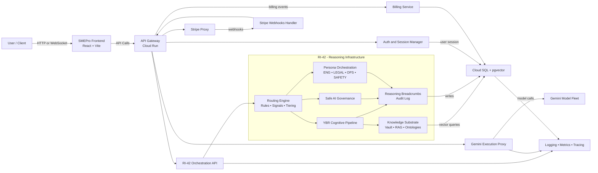
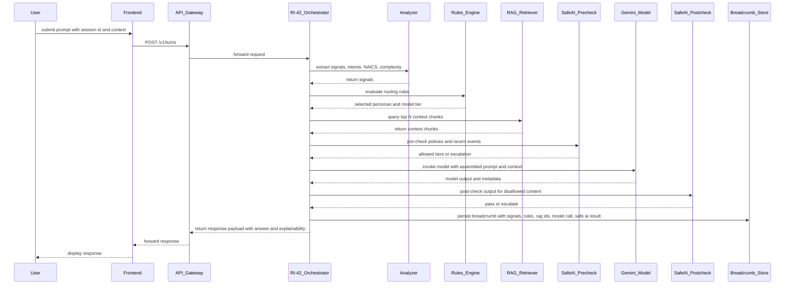
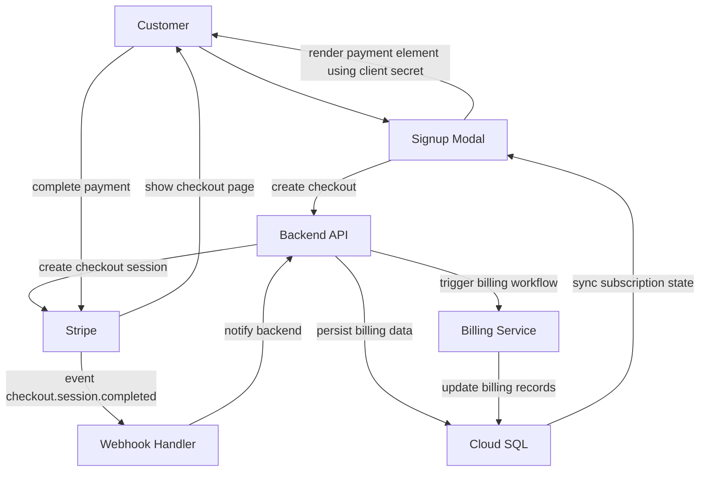
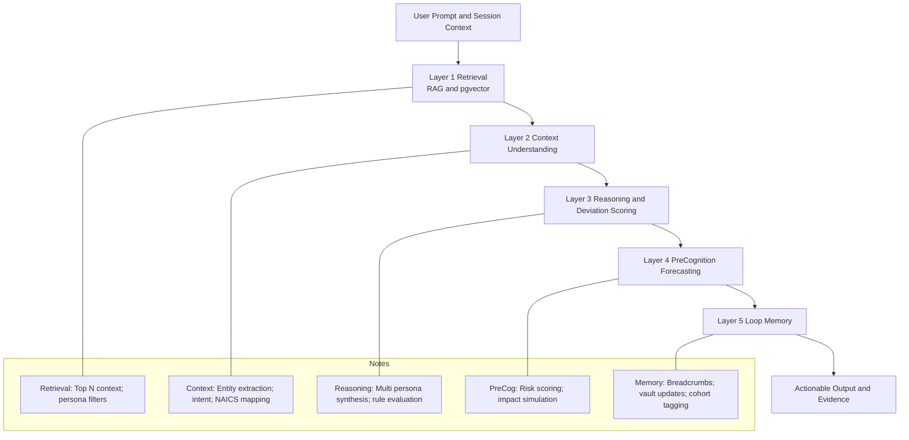

### Overview

Below is a turnkey package you can paste directly into your docs, README, or markdown pages. It contains four **Mermaid** diagrams (backend architecture, `/turns` sequence, Stripe subscription lifecycle, and YBR pipeline) that are formatted to avoid common GitHub Mermaid parser issues. Each block is ready to drop into a `.md` file under `docs/` or `README.md`.

---

### How to use

- Paste each Mermaid block into your Markdown file as shown.  
- Ensure your renderer supports Mermaid (GitHub README, GitHub Pages with mermaid enabled, or a docs site with Mermaid).  
- If a diagram fails to render, remove any extra leading spaces and confirm the file is saved with UTF-8 encoding.

---

### Backend architecture

---

### /turns request lifecycle

---

### Stripe subscription lifecycle

---

### YBR cognitive pipeline

---
